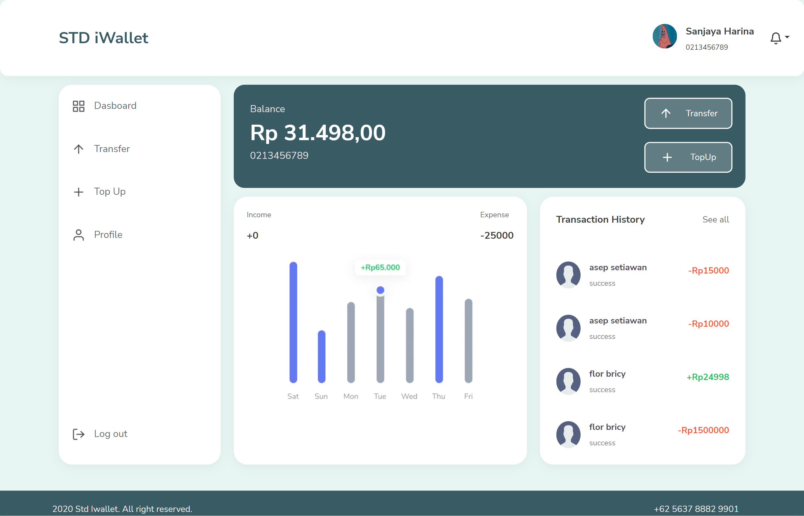
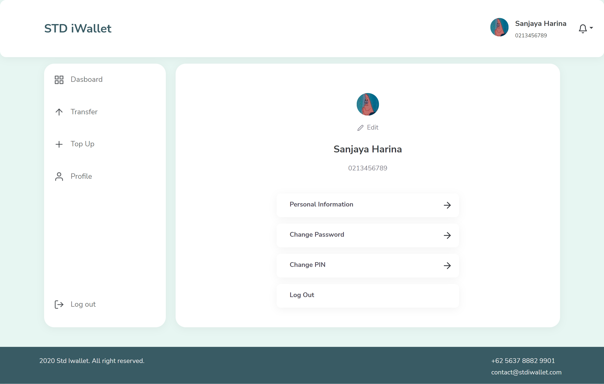

## Preview





# STD iWallet

This is Web version of STD iWallet app for payment. <br/>
This app is build using Reactjs for frame work and Bootstrap as styling

## Built with 


## Requirement
1. Next Js
2. Node Js
3. Backend URL [here](https://github.com/ramdhanstdi/fw9-backend)

## Need To Know 
1. [Axios](https://axios-http.com/docs/intro)
2. [React-Redux](https://react-redux.js.org/)
## Run App
1. You can clone this repositories
2. Type `yarn install` on your terminal 
3. Set up ENV
4. You can run using `yarn dev` in your terminal
5. Open [http://localhost:3000](http://localhost:3000) to view it in your browser.

The page will reload when you make changes.\
You may also see any lint errors in the console.

## Set Up ENV
```
REACT_APP_BACK_END_URL={your-backend}
```